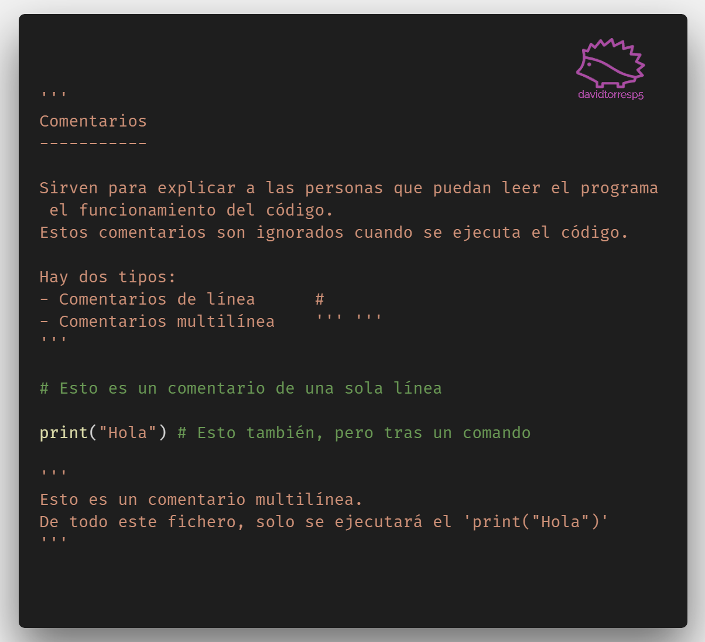
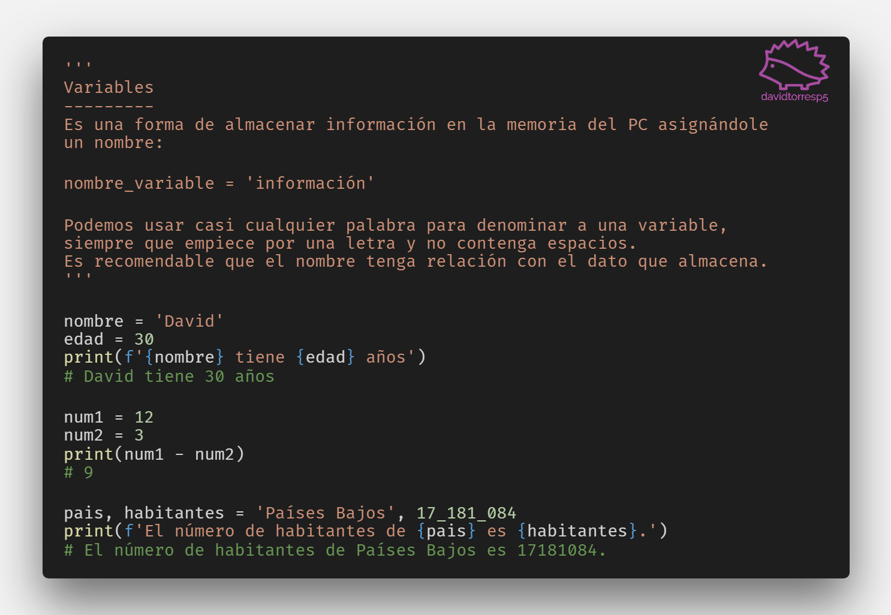

# Curso python wasap

Curso de introducción a la sintaxis de Python mediante tarjetas/imágenes.

- **img/** Tarjetas con las mini-lecciones en formato png.
- **src/** Scripts de python con el código.

## Índice

WIP...

## Ejemplos

")

